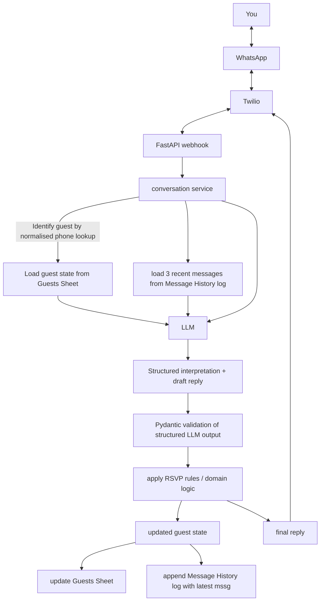

# Whapp RSVP agent

An agentic WhatsApp RSVP assistant for multi-day events (like weddings).

The agent contacts guests, collects RSVP information conversationally, remembers what was said recently and proposes updates to guest state. 

Importantly, **the LLM is not the source of truth.** My application validates those updates, applies deterministic RSVP rules, persists the resulting guest state, and follows up when information is missing.

This project is intentionally built as a small containerised demo. It uses **FastAPI, Twilio WhatsApp, Google Sheets, structured LLM outputs, Docker, and explicit application state.** 

However, it is designed to **scale beyond a prototype** and to be used for actual events. Google Sheets can be replaced with PostgreSQL behind the repository layer without changing the conversation logic, and the WhatsApp integration can be switched from the Twilio Sandbox to a Meta Business number for real-life use.

The architecture keeps these external systems behind interfaces so they can be replaced without changing the core RSVP workflow.

# What it does

Removes the need for having guests fill in RSVP forms (which is highly prone to error), automates RSVP data transfer from individual forms to a database and automates chasing guests that don't respond.

The agent can collect:

- Attendance for each wedding day
- Number of plus-ones
- Food allergies / dietary requirements
- Hotel / accommodation requirements
- RSVP status
- Language of the last message (including code-switching like Hinglish)

It can also handle conversational references like "same as last time you asked."

The agent uses the guest's persisted state and recent conversation context to resolve these references rather than relying on the LLM to remember the entire conversation.

If a guest says they are not attending, the agent stops asking further questions about accommodation, food, etc. The workflow is **state-aware** and stops asking q's that are no longer relevant.

# Running the demo

[Twilio setup instructions]

Once the service is running, join the Twilio WhatsApp Sandbox. The RSVP agent will send you an initial message.

# Architecture

The LLM is responsible for understanding natural language, extracting structured information and drafting a reply in the guest's language.

The application is responsible for:

- Persisting state
- Validating model output
- Applying business rules
- Deciding which fields still need to be collected
- Updating Google Sheets
- Handling webhook retries / idempotency
- Sending the resulting message through Twilio

